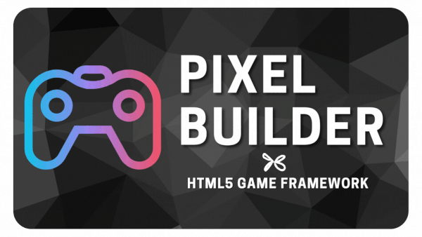

# Pixel Builder 🚀

> Still under development



### 🔗[Getting Started !](https://kefniark.github.io/pixel-builder/getting-started.html)

---
## Description ✈️

Nowadays we can find lot of good **WebGL** Renderer for both 2D and 3D (pixi.js, babylon, ...) but building a solid stack around, can be quite time consuming. There are lot of things to take care of (assets, UI, tooling, config files, webpack, ...)

The idea of **Pixel Builder** is to let you use your Renderer of choice, and provide you all the tools you may need around to speedup your development workflow.

Focus on your game, we take care of your tech stack! 😎

---

## Tech Stack 📦

* 🚢 [Vue3](https://vuejs.org/) (vue-router, vue-i18n, pinia)
* 🤖 [Typescript](https://www.typescriptlang.org/): *TypeScript is JavaScript with syntax for types*
* ⚡ [Vite](https://vitejs.dev/): *Lightning fast build*
* 🧠 **Code splitting** and **Tree shaking**:  Keep the build code small
* 🛠 **Optimize assets** on the fly: *resize, optimize, spritesheet, audio, ...*
* 🧩 **Modular**: *only enable the feature you need, skip the rest*
* 📤 Build for **Web** and **Desktop app** *(Windows, Mac and Linux)*

---

## Getting Started 👍

```sh
# Create a new project
pixel create pixel-project

# Get it started
cd pixel-project
yarn dev
```

---

### Sub Projects 💥

- [@pixel-builder/ecs](./libs/ecs/README.md): ECS for Pixel Builder
- [@pixel-builder/cli](./libs/cli/): CLI tool to create, build your Pixel Project
- [@pixel-builder/core](./libs/core/): Helpers to make project bootstrap easier
